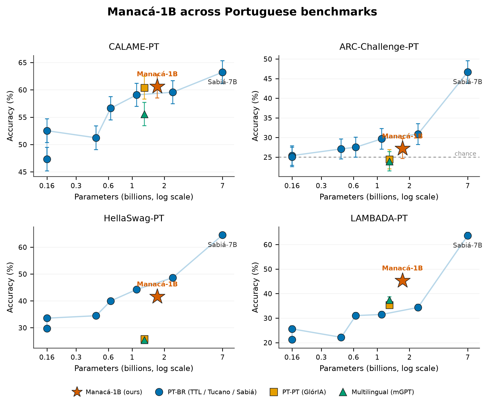
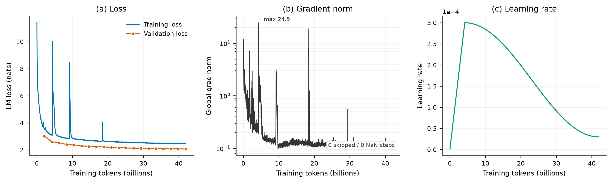

# Manacá-1B — LLM aberto e reprodutível para o Português do Brasil<br>An Open, Reproducible Brazilian-Portuguese Language Model

[](https://creativecommons.org/licenses/by/4.0/)
[]()
[-2496ED.svg)](docs/environment/setup-guide-docker-pt.md)
[]()
[](https://www.lncc.br)

<p align="center">
  
</p>

*Como o manacá-da-serra, que muda de cor a cada estágio de maturação, o Manacá é a*
*inteligência que aprende, evolui e floresce, em Português do Brasil.*
<br>
*Like the manacá-da-serra, whose flowers change colour at each stage of maturation,*
*Manacá is intelligence that learns, evolves, and blooms, in Brazilian Portuguese.*

**[🇧🇷 Português](#português)** · **[🇬🇧 English](#english)**

---

## Português

**Manacá-1B** é um modelo de linguagem decoder-only de **~1,72 bilhão de parâmetros**,
treinado **do zero** para o **português do Brasil** com um pipeline totalmente
containerizado e reprodutível. Este repositório contém tudo o que um leitor do artigo
precisa para **reproduzir o pré-treino e a avaliação** do modelo base: o ambiente
Docker, o pipeline de corpus, o treino do tokenizador, o pré-treino em Megatron-LM, a
conversão de Megatron para HuggingFace e a suíte completa de benchmarks em português
com testes pareados de significância.

**Cooperação científica LNCC × NII/LLM-jp** — Laboratório Nacional de Computação
Científica (Brasil) × National Institute of Informatics (Japão).

### Resultados

Acurácia (%) com erro-padrão em quatro benchmarks de português do Brasil, todos os
modelos sob o mesmo harness. CALAME-PT é pontuado por geração da última palavra;
ARC-Challenge-PT (25-shot), HellaSwag-PT (10-shot) e LAMBADA-PT (0-shot) por
log-verossimilhança. O Manacá-1B usa o tokenizador do treino.

| Modelo | Params (B) | CALAME-PT | ARC-Ch-PT | HellaSwag-PT | LAMBADA-PT |
|--------|-----------:|:---------:|:---------:|:------------:|:----------:|
| Tucano-1b1 | 1.10 | 59.08 | 29.66 | **44.23** | 31.50 |
| GlórIA-1b3 | 1.30 | 60.39 | 24.44 | 25.83 | 35.30 |
| mGPT-1b3 | 1.30 | 55.57 | 23.93 | 25.42 | 37.38 |
| **Manacá-1B** | 1.72 | **60.63** | 27.18 | 41.61 | **45.31** |
| Tucano-2b4 | 2.40 | 59.57 | 30.85 | 48.63 | 34.35 |
| Sabiá-7B | 7.00 | **63.23** | **46.67** | **64.55** | **63.67** |

Leitura honesta: o Manacá-1B é o **modelo mais forte abaixo de 7B na predição da
última palavra** (LAMBADA-PT 45.31, acima de Tucano-1b1, Tucano-2b4, GlórIA-1b3 e
mGPT-1b3, com margens pareadas grandes; só o Sabiá-7B, quatro vezes maior, supera).
Ele **empata** com os melhores modelos de 1 a 2 B do português no CALAME-PT e
**supera** claramente os pares de mesmo porte de outras variedades e línguas; em
raciocínio de múltipla escolha (ARC-Challenge-PT) fica na faixa de acaso, como todo
modelo base nessa escala.

<p align="center">
  
</p>

### O modelo

| Item | Valor |
|------|-------|
| Parâmetros | 1.722.951.680 (~1,72B) |
| Camadas / dim / FFN | 24 / 2048 / 8192 (SwiGLU) |
| Cabeças / grupos KV / head dim | 32 / 8 (GQA) / 64 |
| Posição / norma / bias | RoPE (θ=500000) / RMSNorm / bias em todas as lineares |
| Contexto / precisão | 4096 / bfloat16 |
| Tokenizador | SentencePiece unigram, 64k (padded 64.128), `nmt_nfkc_cf` |
| Framework | Megatron-LM (fork LLM-jp), otimizador distribuído |
| Passos / batch global / tokens | 20.000 / 512 / ~41,9B (~24 tok/param) |
| Referência de arquitetura | LLM-jp-3.1-1.8B |

Detalhes de arquitetura e otimização: [`paper/manaca1b.tex`](paper/manaca1b.tex) e
[`models/README.md`](models/README.md). A conversão Megatron para HuggingFace, que
preserva os biases e desempacota QKV/GQA e o SwiGLU, está em
[`scripts/ckpt_converter/`](scripts/ckpt_converter/).

### O corpus

O corpus foi dimensionado ao modelo e ao hardware. Para ~1,72B de parâmetros, o ponto
de Chinchilla (Hoffmann et al., 2022) é da ordem de ~34B tokens. O corpus tem **~20,1B
tokens únicos** e o pré-treino faz **~2 épocas** (orçamento de ~41,9B tokens de
atualização, ~24 tokens/parâmetro), próximo do compute-optimal; repetição de dados até
~4 épocas rende quase o mesmo que dados frescos (Muennighoff et al., 2023). Todas as
fontes são de **licença aberta**.

| Fonte | Domínio | Tokens | Licença |
|-------|---------|-------:|---------|
| **GigaVerbo** (TucanoBR) — subamostra | Web geral PT-BR | ~14,7 B (73,1%) | Apache-2.0 |
| **Ulysses Tesemõ** (USP) | Jurídico / legislativo | ~4,8 B (23,9%) | Domínio público |
| **Wikipedia-pt** (2023-11) | Enciclopédico | ~0,6 B (3,1%) | CC BY-SA 4.0 |
| **Total** | 33,7M docs | **~20,1 B** | aberta |

Detalhes de cada fonte e do pipeline de limpeza: [`corpus/README.md`](corpus/README.md)
e [`reports/corpora-survey/`](reports/corpora-survey/).

### Dinâmica de treino

A corrida foi estável do zero: **0 iterações puladas e 0 NaN** em toda a execução, a
loss de treino caiu de 11,41 para 2,48 e a loss de validação chegou a 2,07 nats
(perplexidade 7,96), ainda em queda ao final. O log bruto está em
[`docs/training/`](docs/training/).

<p align="center">
  
</p>

### Como reproduzir

Pré-requisitos: Docker Engine 24+, Docker Compose v2 e, para as fases de GPU, o NVIDIA
Container Toolkit. Guia completo:
[`docs/environment/setup-guide-docker-pt.md`](docs/environment/setup-guide-docker-pt.md).

```bash
# 1. Clonar e configurar
git clone https://github.com/brunoleomenezes/manaca-1b-base.git
cd manaca-1b-base
cp .env.example .env            # ajuste DATA_DIR (disco com espaço), HF_TOKEN, ...

# 2. Ambiente e verificação (Fase 1 — CPU)
make build-corpus && make verify

# 3. Corpus (containers destacados)
make gigaverbo && make wikipedia && make ulysses-gdrive && make validate

# 4. Tokenizador (Fase 2a — CPU)
make tokenizer                  # amostra balanceada -> SentencePiece unigram -> HF

# 5. Preparação + pré-treino (Fase 2b — GPU)
make build-train && make preprocess-megatron && make pretrain

# 6. Avaliação em português (Fase 4 — GPU)
make build-eval
./scripts/eval/run_lm_eval_pt.sh   # ARC-Ch-PT, HellaSwag-PT, LAMBADA-PT
./scripts/eval/run_eval.sh         # CALAME-PT (scorer próprio, tokenizador do treino)
```

O `Makefile` documenta todos os atalhos (`make help`). Cada fase é um serviço Docker
isolado; o código é montado no container (bind mount), editável sem reconstruir a
imagem. Os scripts de avaliação e os testes pareados estão em
[`scripts/eval/`](scripts/eval/).

### Hardware e reprodutibilidade

O Manacá-1B foi treinado em **hardware acessível**, não em um supercomputador: o
pipeline foi validado ponta a ponta em uma máquina com **2 GPUs de 24 GB (NVIDIA
Ampere, sem NVLink)** para o pré-treino do 1,72B com bf16 + FlashAttention. Princípios:
ambiente congelado (imagens Docker com dependências pinadas), proveniência de execução
(commit, hiperparâmetros e versões gravados a cada corrida) e portabilidade HPC (as
mesmas imagens convertem-se para Apptainer/Singularity).

### O nome

O manacá-da-serra (*Tibouchina mutabilis*) é endêmico da Mata Atlântica e tem flores
que mudam de cor, branco, rosa-lilás e púrpura, coexistindo na mesma árvore, uma
metáfora dos estágios de maturação de um modelo de linguagem. Em japonês, **マナカ**
significa "verdadeiro centro", uma ponte cultural Brasil-Japão. Fundamentação:
[`docs/identity/name-proposal.md`](docs/identity/name-proposal.md).

### Documentos

| Documento | Link |
|-----------|------|
| ★ Preprint (arXiv, LaTeX) | [paper/manaca1b.tex](paper/manaca1b.tex) |
| Guia de configuração Docker | [setup-guide-docker-pt.md](docs/environment/setup-guide-docker-pt.md) |
| Relatório de avaliação (10 modelos, testes pareados) | [manaca-1b-base-eval-pt.md](docs/evaluation/manaca-1b-base-eval-pt.md) |
| Manual técnico do corpus | [corpus/README.md](corpus/README.md) |
| Levantamento de corpora PT-BR | [corpora-survey.md](reports/corpora-survey/corpora-survey.md) |
| Proposta do nome (identidade) | [name-proposal.md](docs/identity/name-proposal.md) |

### Equipe

| Nome | Instituição | Papel |
|------|-------------|-------|
| **Bruno Leonardo Santos Menezes** | LNCC / Instituto de IA | Pesquisador principal |
| **Carlos Leonardo Souza Cardoso** | LNCC / Instituto de IA | Pesquisador |
| **Prof. Fábio André Machado Porto** | LNCC / Instituto de IA | Coordenador científico |

**Contato:** `brunolsm@lncc.br` · `cardoso@lncc.br` · `fporto@lncc.br`

### Trabalho futuro

Este repositório entrega o **modelo base** (pré-treino + avaliação). As próximas etapas,
deixadas para trabalho futuro, incluem os benchmarks nativos do Open Portuguese LLM
Leaderboard sob o mesmo protocolo pareado, a extensão do orçamento de tokens além do
compute-optimal e o ajuste de instrução do Manacá.

### Licença e citação

Licenciado sob **Creative Commons Attribution 4.0 International (CC BY 4.0)**. Um arquivo
[`CITATION.cff`](CITATION.cff) acompanha o repositório.

```
Menezes, B.L.S., Cardoso, C.L.S., & Porto, F.A.M. (2026). Manacá-1B: An Open,
Reproducible Brazilian-Portuguese Language Model and a Tokenizer-Aware, Paired
Evaluation. Preprint. LNCC (Instituto de IA) × NII/LLM-jp.
GitHub: https://github.com/brunoleomenezes/manaca-1b-base · License: CC BY 4.0.
```

---

## English

**Manacá-1B** is an open decoder-only language model of **~1.72 billion parameters**,
trained **from scratch** for **Brazilian Portuguese** with a fully containerized,
reproducible pipeline. This repository contains everything a reader of the paper needs
to **reproduce the pretraining and the evaluation** of the base model: the Docker
environment, the corpus pipeline, the tokenizer training, the Megatron-LM pretraining,
the Megatron to HuggingFace conversion, and the full Portuguese benchmark suite with
paired significance tests.

**Scientific cooperation LNCC × NII/LLM-jp** — National Laboratory for Scientific
Computing (Brazil) × National Institute of Informatics (Japan).

### Results

Accuracy (%) with standard error on four Brazilian-Portuguese benchmarks, all models
under one harness. CALAME-PT is scored by greedy last-word generation; ARC-Challenge-PT
(25-shot), HellaSwag-PT (10-shot), and LAMBADA-PT (0-shot) by log-likelihood. Manacá-1B
uses its training tokenizer.

| Model | Params (B) | CALAME-PT | ARC-Ch-PT | HellaSwag-PT | LAMBADA-PT |
|-------|-----------:|:---------:|:---------:|:------------:|:----------:|
| Tucano-1b1 | 1.10 | 59.08 | 29.66 | **44.23** | 31.50 |
| GlórIA-1b3 | 1.30 | 60.39 | 24.44 | 25.83 | 35.30 |
| mGPT-1b3 | 1.30 | 55.57 | 23.93 | 25.42 | 37.38 |
| **Manacá-1B** | 1.72 | **60.63** | 27.18 | 41.61 | **45.31** |
| Tucano-2b4 | 2.40 | 59.57 | 30.85 | 48.63 | 34.35 |
| Sabiá-7B | 7.00 | **63.23** | **46.67** | **64.55** | **63.67** |

Honest reading: Manacá-1B is the **strongest model below 7B on last-word prediction**
(LAMBADA-PT 45.31, above Tucano-1b1, Tucano-2b4, GlórIA-1b3, and mGPT-1b3, with large
paired margins; only Sabiá-7B, four times larger, scores higher). It **ties** the best
1-to-2B Portuguese models on CALAME-PT and clearly **beats** same-size peers from other
varieties and languages; on multiple-choice reasoning (ARC-Challenge-PT) it sits near
chance, as does every base model at this scale. The full table, the paired McNemar
tests, and the harness validation are in the [preprint](paper/manaca1b.tex) and in
[`docs/evaluation/`](docs/evaluation/).

### The model

| Item | Value |
|------|-------|
| Parameters | 1,722,951,680 (~1.72B) |
| Layers / model dim / FFN | 24 / 2048 / 8192 (SwiGLU) |
| Heads / KV groups / head dim | 32 / 8 (GQA) / 64 |
| Position / norm / bias | RoPE (θ=500000) / RMSNorm / all linear layers |
| Context length / precision | 4096 / bfloat16 |
| Tokenizer | SentencePiece unigram, 64k (padded 64,128), `nmt_nfkc_cf` |
| Framework | Megatron-LM (LLM-jp fork), distributed optimizer |
| Steps / global batch / tokens | 20,000 / 512 / ~41.9B (~24 tok/param) |
| Architecture reference | LLM-jp-3.1-1.8B |

Architecture and optimization details are in [`paper/manaca1b.tex`](paper/manaca1b.tex)
and [`models/README.md`](models/README.md). The Megatron to HuggingFace conversion,
which preserves the biases and unpacks QKV/GQA and the SwiGLU, is in
[`scripts/ckpt_converter/`](scripts/ckpt_converter/).

### The corpus

The corpus is sized to the model and the hardware. For ~1.72B parameters, the Chinchilla
point (Hoffmann et al., 2022) is on the order of ~34B tokens. The corpus holds **~20.1B
unique tokens** and pretraining runs for **~2 epochs** (a budget of ~41.9B update tokens,
~24 tokens per parameter), close to compute-optimal; repeating data up to ~4 epochs is
nearly as effective as fresh data (Muennighoff et al., 2023). Every source is **openly
licensed**.

| Source | Domain | Tokens | License |
|--------|--------|-------:|---------|
| **GigaVerbo** (TucanoBR) — subsample | General web PT-BR | ~14.7B (73.1%) | Apache-2.0 |
| **Ulysses Tesemõ** (USP) | Legal / legislative | ~4.8B (23.9%) | Public domain |
| **Wikipedia-pt** (2023-11) | Encyclopedic | ~0.6B (3.1%) | CC BY-SA 4.0 |
| **Total** | 33.7M docs | **~20.1B** | open |

Per-source details and the cleaning pipeline are in [`corpus/README.md`](corpus/README.md)
and [`reports/corpora-survey/`](reports/corpora-survey/).

### Training dynamics

The run was stable from scratch: **0 skipped iterations and 0 NaN** across the whole run,
the training loss fell from 11.41 to 2.48, and the validation loss reached 2.07 nats
(perplexity 7.96), still declining at the end. The raw log is in
[`docs/training/`](docs/training/).

### How to reproduce

Prerequisites: Docker Engine 24+, Docker Compose v2, and, for the GPU phases, the NVIDIA
Container Toolkit. Full guide:
[`docs/environment/setup-guide-docker-pt.md`](docs/environment/setup-guide-docker-pt.md).

```bash
# 1. Clone and configure
git clone https://github.com/brunoleomenezes/manaca-1b-base.git
cd manaca-1b-base
cp .env.example .env            # set DATA_DIR (a disk with space), HF_TOKEN, ...

# 2. Environment and verification (Phase 1 — CPU)
make build-corpus && make verify

# 3. Corpus (detached containers)
make gigaverbo && make wikipedia && make ulysses-gdrive && make validate

# 4. Tokenizer (Phase 2a — CPU)
make tokenizer                  # balanced sample -> SentencePiece unigram -> HF

# 5. Data prep + pretraining (Phase 2b — GPU)
make build-train && make preprocess-megatron && make pretrain

# 6. Portuguese evaluation (Phase 4 — GPU)
make build-eval
./scripts/eval/run_lm_eval_pt.sh   # ARC-Ch-PT, HellaSwag-PT, LAMBADA-PT
./scripts/eval/run_eval.sh         # CALAME-PT (own scorer, training tokenizer)
```

The `Makefile` documents every shortcut (`make help`). Each phase is an isolated Docker
service; the repository code is mounted into the container (bind mount), so scripts are
editable without rebuilding the image. The evaluation scripts and paired significance
tests are in [`scripts/eval/`](scripts/eval/).

### Hardware & reproducibility

Manacá-1B was trained on **accessible hardware**, not on a supercomputer: the pipeline
was validated end to end on a machine with **2 GPUs of 24 GB (NVIDIA Ampere, no NVLink)**
for the 1.72B pretraining with bf16 + FlashAttention. Principles: a frozen environment
(Docker images with pinned dependencies), run provenance (commit, hyperparameters, and
versions recorded on each run), and HPC portability (the same images convert to
Apptainer/Singularity).

### The name

The manacá-da-serra (*Tibouchina mutabilis*) is endemic to the Atlantic Forest and bears
flowers that change colour, white, pink-lilac, and purple, coexisting on the same tree, a
metaphor for the maturation stages of a language model. In Japanese, **マナカ** means
"true center", a Brazil-Japan cultural bridge. Rationale:
[`docs/identity/name-proposal.md`](docs/identity/name-proposal.md).

### Documents

| Document | Link |
|----------|------|
| ★ Preprint (arXiv, LaTeX) | [paper/manaca1b.tex](paper/manaca1b.tex) |
| Docker setup guide | [setup-guide-docker-pt.md](docs/environment/setup-guide-docker-pt.md) |
| Evaluation report (10 models, paired tests) | [manaca-1b-base-eval-pt.md](docs/evaluation/manaca-1b-base-eval-pt.md) |
| Corpus technical manual | [corpus/README.md](corpus/README.md) |
| PT-BR corpora survey | [corpora-survey.md](reports/corpora-survey/corpora-survey.md) |
| Name proposal (identity) | [name-proposal.md](docs/identity/name-proposal.md) |

### Team

| Name | Institution | Role |
|------|-------------|------|
| **Bruno Leonardo Santos Menezes** | LNCC / AI Institute | Lead researcher |
| **Carlos Leonardo Souza Cardoso** | LNCC / AI Institute | Researcher |
| **Prof. Fabio André Machado Porto** | LNCC / AI Institute | Scientific coordinator |

**Contact:** `brunolsm@lncc.br` · `cardoso@lncc.br` · `fporto@lncc.br`

### Future work

This repository delivers the **base model** (pretraining + evaluation). The next steps,
left to future work, include the native benchmarks of the Open Portuguese LLM Leaderboard
under the same paired protocol, extending the token budget beyond compute-optimal, and
instruction-tuning Manacá.

### License & citation

Licensed under **Creative Commons Attribution 4.0 International (CC BY 4.0)**. A
[`CITATION.cff`](CITATION.cff) file accompanies the repository.

```
Menezes, B.L.S., Cardoso, C.L.S., & Porto, F.A.M. (2026). Manacá-1B: An Open,
Reproducible Brazilian-Portuguese Language Model and a Tokenizer-Aware, Paired
Evaluation. Preprint. LNCC (AI Institute) × NII/LLM-jp.
GitHub: https://github.com/brunoleomenezes/manaca-1b-base · License: CC BY 4.0.
```

---

*Projeto Manacá — LNCC (Instituto de IA) × NII/LLM-jp · Manacá-1B (base)*
